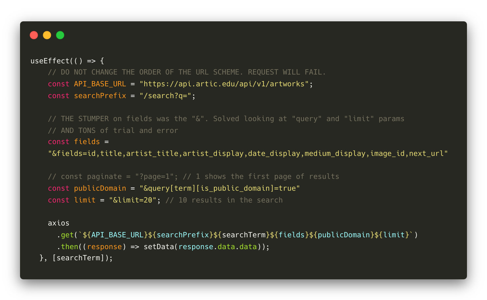

<!-- MARKDOWN PRIMER -->
<!-- https://meakaakka.medium.com/a-beginners-guide-to-writing-a-kickass-readme-7ac01da88ab3 -->

# Art Institute of Chicago, APIs, and React

## Motivation
The core motivation for building this app was to test and grow my skills as a developer by buiding a Single Page (React) Application that pulls data from an API with useEffect and updates the view using useState React Hooks. My personal motivation was to do this using an API that aligned with my interests and sensibilties, while being open/accessible/user friendly. In the future, I plan on expanding the app to incorporate the [p5.js](https://p5js.org/) Library and React npm packages [integrate](https://dev.to/christiankastner/integrating-p5-js-with-react-i0d) p5.js into the React ecosystem.
<!-- 
## Build Status -->

<!-- ## Images/Wireframe
GIF recording of site. -->

## Tech/framework used
### Built with
This app is built using [React](https://react.dev/), JSX, and CSS. It is scaffolded using [Vite. It relies on the Art Institute of Chicago's [public API](https://www.artic.edu/open-access/public-api) and [axios](https://axios-http.com) to fetch the data from said API.

### Favorite Block of Code

The Art Institute's API is deep and extensive. That is both a blessing and a curse. It became the best and the most challenging aspect of building the app. While their documentation is extensive not everything is spelled out explicitly. In particular, the URL scheme has many options for the [parameters](https://api.artic.edu/docs/#endpoints) one can feed it. When using the "search" param, the only data that I could use in the view was the artwork title (even though there are literally hundreds of objects available in the JSON), so I needed "fields". The moment I'm most proud of in navigating these parameters literally hinges on a single character: "&" in the "fields" portion of the URL scheme, which let (almost) everything fall into place. Adding this made the majority of my views possible by returning the data I wanted/needed from the API. I'm still working on figuring out returning the correct [pagination](https://api.artic.edu/docs/#pagination) object/link from the API. Would also like to implement [authentication](https://api.artic.edu/docs/#authentication).
## Design
The design mimics Art Institute of Chicago's own search results page, with a few exceptions that are my own preferences. The goal is a minimal, clean, beautiful display of the search results and visual cues that point to functionality (link animations and color changes, for example). 
### Type  
Typefaces include Topaz (serif text) and Lato (serif text). The Art Institute uses Topaz for serif text and Ideal Sans for sans-serif text.

## Roadmap
+ One.
+ Two.
+ Three.
+ Four.
+ Five.
+ More to be added...

## Bugs
+ One.
+ Two.
+ Three.
+ Four.
+ Five.
+ More to be added...

<!-- ## Contribute
Would love to have any and all ideas from people. -->

## Credits
This app would not have been possible without the amazing help from all of the below.
#### Per Scholas
Thank you to [Per Scholas](https://perscholas.org/) for living out its [mission](https://perscholas.org/about-per-scholas/) and providing the tuition-free tech training that has enabled me in so many ways.

Big thanks to Kat[Kat Saung](https://github.com/KatySaung/), my classmate, for helping without knowing she did. Some of the searches I tried based off of an informal discussion led to several UX and back end improvements. And thank you to my cohort at large. Discord people: "you know what it is!"
#### LinkedIn Learning & Chicago Public Library
I used the [LinkedIn Learning](https://www.linkedin.com/learning/?u=116852650) platform and [Chicago Public Library's](https://www.chipublib.org) subscription to the service for research, reinforcement of React concepts, and to learn new things in building this app. I'll continue to do so as I further it. 

#### Per Scholas.
Thank you to the [Art Institute of Chicago](https://www.artic.edu/) for being a world-class institution in general, and specifically for the technology department for building such great resources that further its mission and making those resources publicly available and accessible, like the [API](https://www.artic.edu/open-access/public-api) this app is built on.

## License
2023 © Copyright: Andrew Doak [mrandrewdoak@gmail.com](mailto:mrandrewdoak@gmail.com)